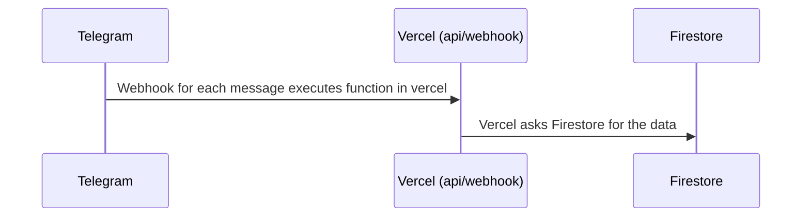

# Description

Telegram bot used to keep record of an online racing competition like F1. The users will be able to add its records inside a group using the bot and get the classifications.

# Architecture

# Using the bot

# Repository
Fork the repository, you will need it in order to deploy to vercel

## Create a bot

Use **BotFather** to request a bot in telegram. Ask for the token and save the token and the bot name it should be used when running dev environment ( see scripts )

## Firestore db

Create a new firestore in firebase and get config from firestore general settings:

## Vercel functions

Create a project in vercel and assign github account to the project to be able to deploy

const firebaseConfig = {
  apiKey: <APIKEY>,
  authDomain: <AUTHDOMAIN>,
  projectId: <PROJECTID>,
  storageBucket: <STORAGEBUCKET>,
  messagingSenderId: <MESSAGINGSENDERID>,
  appId: <APPID>
};

## Add environment variables in Vercel

Go to settings/Environment Variables in Vercel's project and add the environment variables needed:
- APIKEY, AUTHDOMAIN, PROJECTID, STORAGEBUCKET, MESSAGINGSENDERID, APPID -> Obtained from firestore config
- BOT_NAME, TELEGRAM_TOKEN -> Both given by **BotFather**. Using the bot you can get that info.

## Run on local environment
To run the application locally .env.template to create a new .env file with the credentials from firebase and the bot name and the telegram token

### Define Telegram webhook
- Run yarn dev to run the local environment
- Use ngrok to create a public url to your local environment ( npx ngrok http 3000 ) you need this in order to link the telegram's webhook to vercel functions
- assign ngrok url to the telegram's webhook using ( use your TELEGRAM_TOKEN instad of <TELEGRAM_TOKEN>, all included ):
    https://api.telegram.org/bot<TELEGRAM_TOKEN>/setWebhook \
    -H "Content-type: application/json" \
    -d '{"url": "https://xxx.ngrok.io/api/webhook"}'
- once done you can use the bot

## Use the bot inside a group

The bot is prepared to run inside a group. All the registries are persisted using the id of the group. To use it, create a group and add the bot to it. Each message in the group will execute the vercel function using the webhook. Each time the function is executed it will parse the command, it will only respond to messages directed to the bot (@BotName) and it will parse the commands available, that can be configured in groupBot.config.js ( both the comments and the response missatges of the bot)

## Run on vercel dev environment

## Build
- Run yarn build:dev

### Define Telegram webhook
- Run yarn build:dev
- assign vercel **dev** url to the telegram's webhook using:
    https://api.telegram.org/bot<TELEGRAM_TOKEN>/setWebhook \
    -H "Content-type: application/json" \
    -d '{"url": "https://vercel-xxxxx-<user>.vercel.app/api/webhook"}'
- once done telegram will send the messages to that url

## Run on vercel prod environment

## Build
- Run yarn build:prod

### Define Telegram webhook
- assign vercel **dev** url to the telegram's webhook using:
    https://api.telegram.org/bot5422843373:AAEvfPNUZTiySuXqE74btK_tsp2ZKtZZnXo/setWebhook \
    -H "Content-type: application/json" \
    -d '{"url": "https://vercel-xxxxx-<user>.vercel.app/api/webhook"}'
- once done telegram will send the messages to that url

